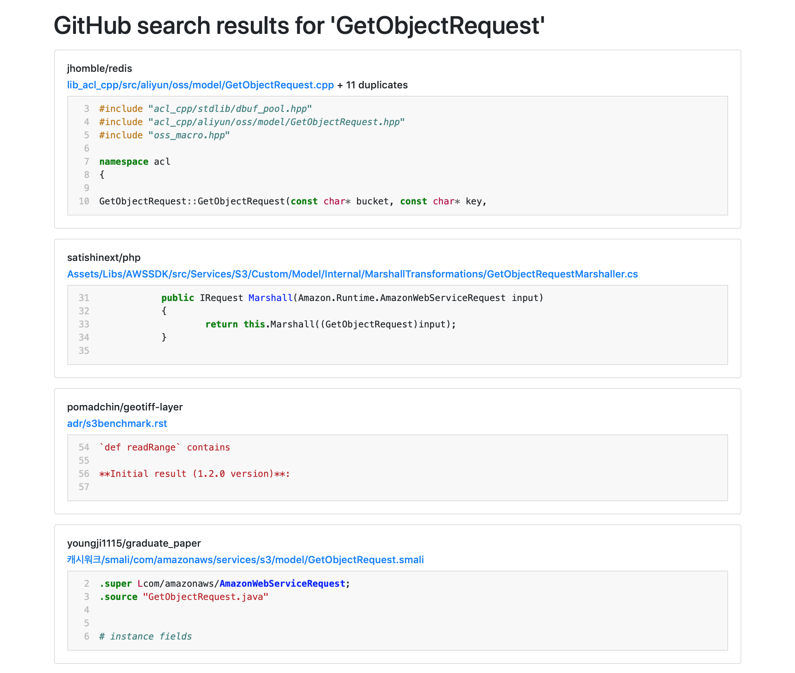

# github-code-search

This is a demo of GitHub code search that de-duplicates results from identical files.
It compares SHA1 hashes and file contents to mark files as identical, and combine their results into one.

It's a proof-of-concept, rather than a hardened search tool.

Dear GitHub, please steal these ideas for the first-party code search 😉



## Installation

Clone this repository, create a new virtualenv with Python 3.6 or later, and install the dependencies.

```console
$ git clone git@github.com:alexwlchan/github-code-search.git
$ cd github-code-search
$ virtualenv env
$ source env/bin/activate
$ pip3 install -r requirements.txt
```

You also need a personal access token for GitHub, which you can get from [the GitHub developer settings](https://github.com/settings/tokens).
This token needs the `public_repo` scope.

## Usage

1.  Call the first script with your query and API token:

    ```console
    $ python search_github.py GetObjectRequest --api_token=abc123
    _cache/https-api-github-com-search-codeqgetobjectrequest.json
    ```

    The path it prints is a JSON file which contains the response from the GitHub Search API.
    The response is cached because searching all public repos is a fairly expensive operation, and we don't want to be rate limited.

2.  Call the second script, which takes the path to this JSON file and renders the output as an HTML page.
    Save the output to a file:

    ```console
    $ python3 render_search_results.py _cache/https-api-github-com-search-codeqgetobjectrequest.json --api_token=abc123 > getobject_search.html
    ```

3.  Open the file in your web browser, and scroll through your search results:

    ```console
    $ open getobject_search.html
    ```

## Next steps

This is a proof-of-concept I wrote in a single train journey, not a hardened application.
I'm not planning to work on it any further, but I did have some ideas on what you could do next:

*   **Should duplicate results weight higher in the search?**
    If the same file appears in 100 repos, should that increase the search ranking?
    I'm not sure -- it would be interesting to experiment.

*   **Detect nearly-duplicate files.**
    If two files are the same, except for some lines that are unrelated to the search, treat those two files as the same.
    This requires more sophisticated diffing logic.

*   **Highlight search terms inside the code snippets.**
    If you use regular GitHub code search, it highlights the search terms within the code snippet.
    I don't do that yet, but there's (probably) enough information in the API to do that.

*   **Make it faster!**
    Right now it's pretty slow -- it has to fetch the contents of every unique file that appears in the search results.
    Parallelising the HTTP requests or doing something fancy with GraphQL to reduce the number of requests would make it faster.

*   **Pagination.**
    Right now it only uses the first page of results, even though the API is paginated.
    It'd be nice to expose later results in some way.

*   **Give more visibility into the duplicate results.**
    Any duplicate results are just hidden behind "+N duplicates".
    Completely hiding them is probably a mistake – there might be circumstances in which you want to see the duplicates (although I don't think that's the common use case).
    It would be good if there was some way to see them if you really wanted.

## License

MIT.
